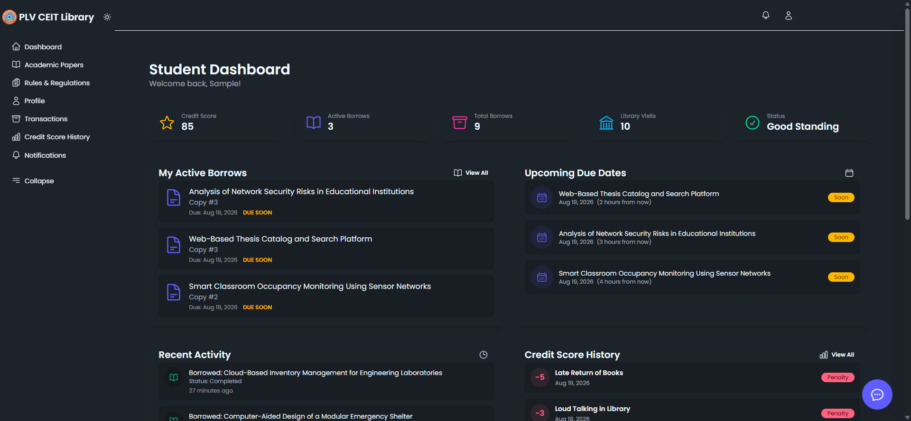
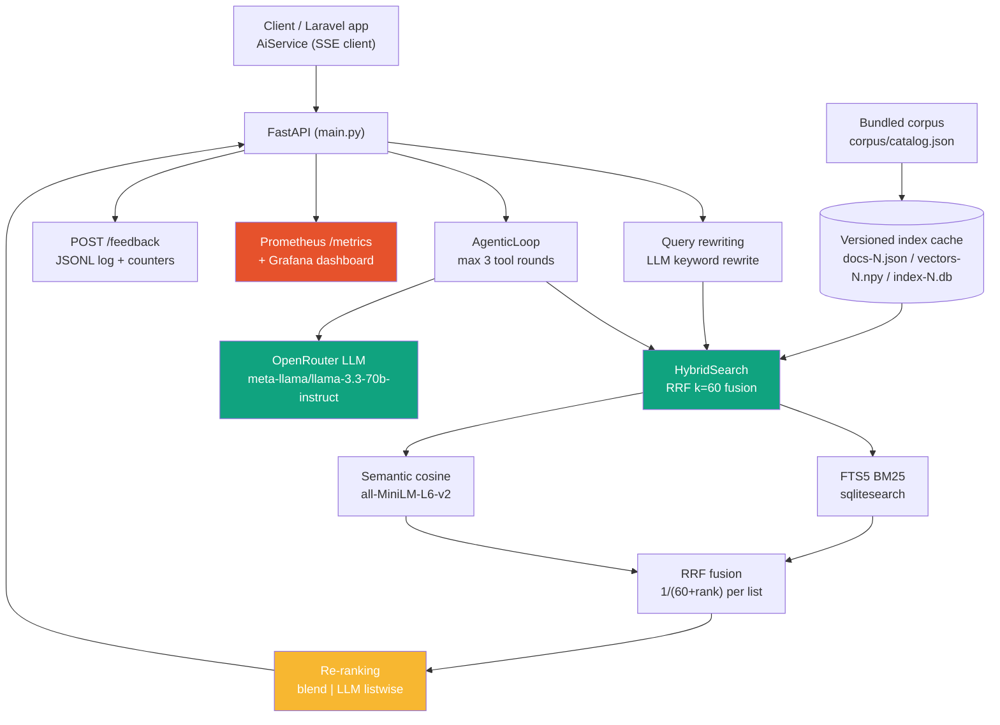

# CEIT AI Sidecar — Hybrid Search + RAG assistant

Course project for the **LLM Zoomcamp** program: a self-contained hybrid
retrieval and RAG service for the CEIT university library, delivered as a
single reproducible repo.

The sidecar serves the [CEIT Library AI assistant](https://github.com/PSergio984/CEIT-Library).
It combines **FTS5 BM25 keyword search** with **English semantic embeddings**
(`all-MiniLM-L6-v2`), fuses both with **Reciprocal Rank Fusion (k=60)**,
applies post-retrieval metadata filters, and answers grounded questions over
the retrieved documents with a bounded, citation-carrying LLM loop. It ships
with evaluation (retrieval + LLM-as-judge), Prometheus/Grafana monitoring, a
thumbs up/down feedback loop, query rewriting, re-ranking, and a
Docker-based deployment — see the [Rubric mapping](#rubric-mapping) table.

---

## Live demo

The Laravel front door is deployed on Laravel Cloud and wired to the
sidecar on FastAPI Cloud:

- **App:** <https://ceit-library-main-cru0ty.laravel.cloud> — use the
  **"Log in with demo student"** button on the login page (seeded account,
  no registration needed). The chat widget is on every authenticated page.
- **Sidecar (API):** <https://ceit-ai-sidecar.fastapicloud.dev> — token-gated
  (`X-Sidecar-Token`); interactive docs at `/docs`.




---

## Table of contents

- [Problem statement](#problem-statement)
- [Live demo](#live-demo)
- [Dataset](#dataset)
- [Architecture and flow](#architecture-and-flow)
- [Run it](#run-it)
- [Endpoints](#endpoints)
- [Evaluation](#evaluation)
- [Monitoring and feedback](#monitoring-and-feedback)
- [Best-practice extras](#best-practice-extras)
- [Rubric mapping](#rubric-mapping)
- [Project structure](#project-structure)
- [Testing](#testing)
- [Security notes](#security-notes)

---

## Problem statement

A university library catalog has two search problems that a single approach
cannot solve:

1. **Keyword search alone** misses paraphrase and Taglish questions
   ("anong paper tungkol sa flood monitoring?").
2. **Vector search alone** misses exact identifiers — catalog codes
   (`CEIT-IT-23-01`) and exact titles.

On top of retrieval, a chat assistant that answers from memory hallucinates.
The sidecar exists to make retrieval precise and answers grounded:

- **Hybrid retrieval** — BM25 and semantic results fused by Reciprocal Rank
  Fusion (k=60), so both exact and paraphrased queries work; exact catalog
  codes pin their document to rank 1.
- **Post-retrieval filters** — paper type, department, publication year range,
  author, adviser — applied before fusion so a filtered-out document can never
  outrank a relevant one.
- **Agentic search** — a bounded tool-calling loop (max 3 searches) for
  multi-hop questions one-shot retrieval can't answer.
- **Grounded chat** — answers cite numbered documents from the retrieved set,
  or refuse ("I don't have enough information") with **zero LLM calls** when
  retrieval finds nothing.
- **Freshness** — atomic, versioned index rebuilds; readers never observe a
  half-built index.

Target users: the CEIT-Library assistant itself, plus any future client that
wants hybrid search over the library corpora.

## Dataset

The corpus is bundled in the repo (self-contained — no external export
required): `corpus/catalog.json` (**959** academic papers) and
`corpus/policies.json` (**379** rulebook regulations) — 1,338 documents
total. Each catalog document carries title, text, department, publication
year, paper type, catalog code, authors, and advisers.

The data is **synthetic** (Faker-generated authors and titles over real CEIT
catalog shapes), so committing it is safe. In production the corpus is
exported from the Laravel database and either read from disk or pushed via
`POST /corpus/upload`; the export/upload contract is unchanged. The
evaluation data is built FROM the bundled corpus by reproducible scripts
(`scripts/build_golden.py`, `scripts/build_judge_questions.py`) — regenerate
them whenever the corpus changes so the numbers always describe the shipped
data.

## Architecture and flow



### Search pipeline

1. **Query rewriting** (optional, `QUERY_REWRITE=1`): the LLM rewrites a
   conversational/Taglish query into a keyword-style search query; falls back
   to the original query on any failure.
2. **Keyword**: SQLite FTS5 via `sqlitesearch` — BM25 ranks over the full
   corpus (no candidate pooling). Query tokens keep digits (years, catalog
   codes) and drop English stop words — matching the unicode61 index on
   everything that discriminates while staying noise-free on function words.
3. **Semantic**: whole-document embeddings, normalized, cosine via matmul,
   gated by `MIN_SEMANTIC_SIMILARITY` (default 0.5) — when even the nearest
   document falls below the cosine threshold, the query has no relevant
   semantic match, so off-corpus queries return nothing instead of
   nearest-neighbour noise.
4. **Filters**: paper type, department, publication year, year range, author,
   adviser — applied to the merged candidate set **before** fusion.
5. **Fusion**: RRF with k=60 (`1/(60 + rank)` per list).
6. **Code pin**: exact `CEIT-XX-NN[-N]` catalog codes pin the matching
   document to rank 1.
7. **Re-ranking** (optional, `RERANK_MODE=blend|llm`): a second pass over the
   top-k candidates (deterministic blend, or RankGPT-style LLM listwise
   re-ranking) that never drops or invents documents.

### Agentic loop

`/chat/stream` runs a bounded function-calling loop (max 3 executed searches).
The first LLM call carries a `search` tool; no tool call means direct answer.
Tool arguments are validated against a closed pydantic schema
(`extra="forbid"`) before execution; results merge into a deduplicated,
numbered citation set. SSE framing is additive: `event: activity` → chunks →
`event: citations` → `data: [DONE]`; empty retrieval yields the canonical
refusal with zero LLM calls.

### Index lifecycle

Rebuilds are always full, from the corpus JSON, into versioned artifacts
(`docs-N.json`, `vectors-N.npy`, `index-N.db`); `state.json` is swapped last
via `os.replace` so readers never observe a half-built index. Old versions are
pruned (keep 2); rebuilds serialize under a global lock; the embedding model
is a lazy thread-safe singleton.

## Run it

### Prerequisites

- Python 3.13 + [uv](https://docs.astral.sh/uv/) — or Docker.

### Local run

```bash
uv sync
cp .env.example .env   # set SIDECAR_TOKEN (and LLM_API_KEY for chat/eval)
uv run uvicorn app.main:app --port 8310
```

First run downloads the compact English embedding model. Build the index once
(the bundled corpus makes this standalone):

```bash
curl -X POST -H "X-Sidecar-Token: $SIDECAR_TOKEN" http://127.0.0.1:8310/index/rebuild
curl -s -H "X-Sidecar-Token: $SIDECAR_TOKEN" http://127.0.0.1:8310/health
```

### Docker (sidecar + Prometheus + Grafana)

```bash
cp .env.example .env   # set SIDECAR_TOKEN (Prometheus scrapes with the same token)
docker compose up --build
```

The Laravel front door has its own compose (app + PostgreSQL) in the
[CEIT-Library repo](https://github.com/PSergio984/CEIT-Library) —
`docker compose up --build` there, and it reaches this sidecar via
`http://host.docker.internal:8310` (set `SIDECAR_URL`/`SIDECAR_TOKEN` to
override). Its login page has a one-click **demo student login**. The same
app is deployed live at <https://ceit-library-main-cru0ty.laravel.cloud>
(see [Live demo](#live-demo)).

| Service    | URL                        | Credentials                     |
|------------|----------------------------|---------------------------------|
| Sidecar    | http://localhost:8310      | `X-Sidecar-Token` header        |
| Prometheus | http://localhost:9090      | loopback-only                   |
| Grafana    | http://localhost:3000      | `admin` + `GRAFANA_ADMIN_PASSWORD` (required, loopback-only) |

Build the index once (the bundled corpus makes this standalone) so the
dashboard's "Indexed documents" panel shows real coverage:

```bash
curl -X POST -H "X-Sidecar-Token: $SIDECAR_TOKEN" http://localhost:8310/index/rebuild
```

Open Grafana → **CEIT AI Sidecar** dashboard (6 panels). See
[Monitoring and feedback](#monitoring-and-feedback).

### FastAPI Cloud deployment

The sidecar also runs on [FastAPI Cloud](https://fastapi.cloud) via
`fastapi run` (`fastapi[standard]` is installed):

1. Deploy the repo; set env vars in the dashboard: `SIDECAR_TOKEN`,
   `LLM_API_KEY` (OpenRouter), `CORPUS_PATH=corpus`.
2. Corpus freshness is automatic: the Laravel `ai:push-corpus` command
   (scheduled hourly) uploads the export to `POST /corpus/upload`, which
   writes the files under `CORPUS_PATH` and rebuilds atomically.
3. Point the Laravel app at `SIDECAR_URL=https://ceit-ai-sidecar.fastapicloud.dev`.

## Walkthrough

A 5-minute end-to-end tour (local run):

1. **Start and build the index** — `uv run uvicorn app.main:app --port 8310`, then
   `POST /index/rebuild` with the token. `/health` flips to `ok` with 1,338
   documents embedded (959 catalog + 379 policy).
2. **Hybrid search** — `POST /search {"query": "flood monitoring using iot sensors"}`
   returns flood-monitoring papers first (ranked by both BM25 and semantic,
   fused by RRF). Try an exact code: `{"query": "CEIT-IT-21-01"}` — the
   matching document is pinned to rank 1 (`"pinned": true`).
3. **Grounded chat** — `POST /chat/stream {"query": "what papers did Jolie
   Hahn write?"}` streams an SSE answer with `event: activity` frames, chunk
   deltas, and a final `event: citations` frame listing the numbered documents.
   Ask something off-corpus ("recipes for a birthday cake") and it refuses with
   zero LLM calls.
4. **Feedback** — `POST /feedback {"query": "...", "rating": "up"}` appends a
   JSONL record and moves the Prometheus counters.
5. **Monitoring** — `GET /metrics` shows the Prometheus exposition; with the
   compose stack up, Grafana charts all of it (traffic, latency p95, feedback,
   index coverage) on one dashboard.
6. **Evaluations** — `uv run python -m app.eval --with-rerank` prints the
   multi-approach retrieval comparison; `uv run python -m app.judge --sample 10`
   runs the LLM-as-judge answer scoring.

## Endpoints

All endpoints require `X-Sidecar-Token`; requests without it get `401`.

| Method | Path             | Description                                   |
|--------|------------------|-----------------------------------------------|
| GET    | `/health`        | Index coverage + staleness (`documents == embedded`) |
| POST   | `/search`        | Hybrid RRF search (query rewrite + re-ranking) with optional filters |
| POST   | `/chat/stream`   | SSE-streamed, citation-grounded RAG answer    |
| POST   | `/index/rebuild` | Synchronous full rebuild (atomic swap)        |
| POST   | `/corpus/upload` | Replace `catalog.json`/`policies.json` and rebuild (fail-closed) |
| GET    | `/metrics`       | Prometheus text exposition                    |
| POST   | `/feedback`      | Record a thumbs up/down (`{query, rating, answer?, result_ids?}`) |

`POST /search` body:
`{"query": "...", "filters"?: {...}, "corpus"?: "catalog"|"policy", "limit"?: 10, "k"?: 60}`.
When query rewriting changes the query, the response includes a
`rewritten_query` field. Each result carries `bm25_rank`, `semantic_rank`, and
`pinned` — `pinned: true` marks the document pinned to rank 1 by an exact
catalog-code query (a hard rule that survives re-ranking).

`POST /chat/stream` body:
`{"query": "...", "mode": "citations"|"question"|"rag", "corpus"?: "...", "top_k"?: 5}`.
Response is `text/event-stream`: `data: {"c": "<delta>"}` chunk lines,
terminated by `data: [DONE]`; provider failures surface as an `event: error`
line before `[DONE]`.

The LLM provider is OpenRouter via the openai SDK
(`LLM_BASE_URL`/`LLM_API_KEY`/`LLM_MODEL`, default
`meta-llama/llama-3.3-70b-instruct`).

## Evaluation

### 1. Multi-approach retrieval comparison

[`app/eval.py`](app/eval.py) scores **three retrieval approaches** on the same
27-case golden set (`data/golden_dataset.json`) through the same seam
(`HybridSearch.rrf_search(method=...)`), plus — with `--with-rerank` — the
**shipped /search pipeline** (hybrid retrieval + blend re-ranking of the top-k,
deterministic, no LLM):

```bash
uv run python -m app.eval                # human-readable, includes comparison table
uv run python -m app.eval --json         # machine-readable report
uv run python -m app.eval --with-rerank  # also score the shipped pipeline
```

Current results (k=5, 27 cases — catalog codes, exact/paraphrase titles,
authors, departments, years, plus 5 negative "should return nothing" cases;
set regenerated from the bundled 1,338-doc corpus by
`scripts/build_golden.py`):

| Approach | P@5   | R@5   | F1@5  | Top-1 | Neg-pass |
|----------|-------|-------|-------|-------|----------|
| **hybrid** (production retrieval) | 0.4545 | 0.7239 | 0.3913 | **0.8182** | **1.0** |
| bm25     | 0.5455 | 0.7517 | 0.4321 | 0.7273 | 1.0 |
| semantic | 0.1091 | 0.3780 | 0.1414 | 0.2727 | 1.0 |
| hybrid + blend re-rank (shipped /search) | 0.4545 | 0.7239 | 0.3913 | **0.8636** | 1.0 |

This evaluation measures the **raw retrieval layer** (deterministic — no LLM,
no rewrite), which is exactly what the rubric's retrieval evaluation asks for.
Query rewriting and re-ranking run on top at request time (see
[Best-practice extras](#best-practice-extras)); they only change the top-k
ordering of what this table ranks. The `--with-rerank` row shows the
deterministic half of that pipeline is **measured, not assumed**: the blend
re-ranker lifts top-1 from 0.82 to 0.86 without ever dropping a document.
Caveat: the eval re-ranks the same k=5 window it scored, while `/search`
defaults to a 10-document window — re-ranking a wider window can surface
documents that rank 6–10 at retrieval.

**Winner rule (documented, stable):** for a library assistant the primary
quality gates are **top-1 rate** (the right document surfaces first — critical
for code/title lookups) and **negative-pass rate** (no irrelevant results);
F1@k breaks ties. Under that rule **hybrid wins**: the code pin nails top-1 on
all four catalog-code cases, and no negative ever leaks. The negative-pass
result is **meaningful**: a negative case passes only when retrieval returns
*no document at all* — guaranteed by the `MIN_SEMANTIC_SIMILARITY` gate
(out-of-domain queries max out at ≈0.12–0.22 cosine vs ≥0.30 for every
positive), so "nothing here" queries genuinely return nothing rather than
nearest-neighbour noise.

**What made the numbers real (and why bm25 beats hybrid on F1):** this corpus
is mostly Faker-Latin text whose embeddings are undiscriminating — semantic
neighbours of gibberish queries are often *policy* documents. Two fixes make
the shipped pipeline honest on the 1,338-doc corpus: (1) the query tokenizer
now keeps digits, so years and catalog codes actually reach FTS5 (previously
`2007` in a query silently matched nothing), and (2) `MIN_SEMANTIC_SIMILARITY`
was raised 0.25 → 0.5 so the semantic channel only fires where embeddings
discriminate (real English titles score ≈0.9; gibberish/name queries score
≈0.35–0.62 and are handled lexically). The residual gap: pure BM25 still
edges hybrid on F1@5 (0.4321 vs 0.3913) — a handful of paraphrase cases
("engineering papers published in 2014") where the semantic channel's noise
dilutes the fusion, and 3 of 8 exact-title gibberish lookups that BM25 itself
cannot disambiguate (Faker reuses a tiny Latin vocabulary). Hybrid's win on
top-1 — the primary gate — comes from the code pin plus the gated semantic
boost on real-English titles.

By category (shipped pipeline: hybrid + blend re-rank):

| Category | n | P@5 | Top-1 |
|----------|---|-----|-------|
| catalog_code (exact CEIT codes) | 4 | 0.20 | 1.00 |
| exact_title | 8 | 0.20 | 0.75 |
| paraphrase | 6 | 0.67 | 0.83 |
| people (papers by author) | 4 | 0.90 | 1.00 |

### 2. LLM-as-judge answer evaluation

[`app/judge.py`](app/judge.py) samples questions, generates grounded answers
through the same `RagService` path the app uses, and scores each answer
**RELEVANT / PARTLY_RELEVANT / NON_RELEVANT** with the configured LLM acting
as judge (no extra model, no labeled dataset).

```bash
uv run python -m app.judge                     # all 40 questions
uv run python -m app.judge --sample 10 --seed 42   # a 10-question sample
uv run python -m app.judge --json --no-write   # summary only, no results file
```

Results are recorded to `data/judge_results.json`. Current recorded run
(10-question sample from the 40 regenerated for the bundled corpus,
`meta-llama/llama-3.3-70b-instruct`, top_k=5, shipped retrieval pipeline):

- **RELEVANT** 9 · **PARTLY_RELEVANT** 1 · **NON_RELEVANT** 0
- Relevant rate: **0.90** · Partly-or-better rate: **1.00**

The question set (`scripts/build_judge_questions.py`) is catalog-only: the
bundled policy corpus is a synthetic placeholder (Faker-Latin regulation
text), so policy Q&A cannot be answered from it — judging it would only
manufacture NON_RELEVANT verdicts. This is documented in
[Limitations](#limitations).

## Monitoring and feedback

- **`GET /health`** — index coverage + staleness (`documents == embedded`,
  `source_generated_at`).
- **`GET /metrics`** — Prometheus text exposition:
  - `ceit_searches_total` (API searches) + `ceit_chat_searches_total`
    (retrievals executed inside `/chat/stream`) — counters
  - `ceit_rebuilds_total` (counter)
  - `ceit_search_duration_seconds` (histogram with latency buckets)
  - `ceit_feedback_total{rating="up"|"down"}` (counters)
  - `ceit_index_documents` (gauge), `ceit_last_rebuild_timestamp_seconds`
- **`POST /feedback`** — thumbs up/down with the query, answer, and retrieved
  doc ids; appends one JSONL line to `FEEDBACK_PATH` (`var/feedback.jsonl`)
  and feeds the `ceit_feedback_total` counters.
- **Grafana dashboard** — `docker compose up --build` provisions a "CEIT AI
  Sidecar" dashboard with **6 charts**: retrieval traffic (API + chat) per
  sec, latency p95, latency average, feedback up/down per sec, indexed
  documents, and index rebuilds total. Provisioning lives in
  [`grafana/`](grafana).


The token-gated API surface (all seven endpoints) is documented live by the
framework at `/docs`:


## Best-practice extras

- **Query rewriting** (`QUERY_REWRITE=1`, default on) — `app/rewrite.py`
  turns conversational/Taglish queries into keyword search queries via the
  configured LLM. Degrades safely: disabled, no API key, or provider failure
  all return the original query.
- **Re-ranking** (`RERANK_MODE=blend|llm|none`, default `blend`) —
  `app/rerank.py` re-orders the top-k candidates after retrieval:
  `blend` is a deterministic consensus+rank re-ranker (docs retrieved by both
  retrievers first, zero extra latency), `llm` is a RankGPT-style listwise
  re-ranker that asks the LLM to reorder the numbered candidates by relevance
  (cross-encoder behaviour without a second model — fits the 500 MB cloud
  budget). Re-ranking never drops or invents documents.

## Rubric mapping

| Rubric item | Where |
|-------------|-------|
| Problem description | [Problem statement](#problem-statement) |
| Dataset (own / prepared) | [Dataset](#dataset) — bundled 1,338-doc synthetic CEIT catalog (959 papers + 379 policies) |
| Retrieval flow: search index + LLM | [Architecture and flow](#architecture-and-flow) + `/search` + `/chat/stream` |
| Interface: RAG API | FastAPI endpoints (token-gated), SSE streaming contract |
| Retrieval evaluation — multiple approaches evaluated, best used | [Multi-approach comparison](#1-multi-approach-retrieval-comparison) — hybrid vs BM25 vs semantic, documented winner rule |
| LLM evaluation — LLM-as-judge | [LLM-as-judge](#2-llm-as-judge-answer-evaluation) — RELEVANT/PARTLY_RELEVANT/NON_RELEVANT |
| Monitoring dashboard | [Monitoring and feedback](#monitoring-and-feedback) — Prometheus `/metrics` + Grafana dashboard (6 panels) |
| Containerization | [Docker](#docker-sidecar--prometheus--grafana) — `Dockerfile` + `docker-compose.yml` |
| Best practice: re-ranking | [Best-practice extras](#best-practice-extras) — blend / LLM listwise |
| Best practice: query rewriting | [Best-practice extras](#best-practice-extras) — LLM rewrite with fallback |
| Cloud bonus | FastAPI Cloud deployment (`fastapi run`, `POST /corpus/upload` hand-off) |

## Project structure

```text
app/
  main.py       # API: /search /chat/stream /index/rebuild /corpus/upload /health /metrics /feedback
  search.py     # HybridSearch: BM25 + semantic + RRF k=60, filters, code pin, method=bm25|semantic|hybrid
  ingest.py     # corpus validation (fail-closed) + embeddings
  rebuild.py    # atomic versioned rebuild, global lock, test embedder hook
  rag.py        # RAG prompts, SSE chunk framing, citation keys
  agent.py      # AgenticLoop: bounded tool loop, closed arg schemas
  rewrite.py    # QueryRewriter: LLM query rewriting with safe fallback
  rerank.py     # Reranker: blend + LLM listwise re-ranking
  judge.py      # LLM-as-judge answer evaluation
  llm.py        # shared lazy OpenRouter client factory
  eval.py       # golden-set retrieval evaluation + multi-approach comparison
  config.py     # pydantic-settings (env / .env)
  health.py     # /health assembly
corpus/         # bundled self-contained corpus (catalog.json + policies.json)
data/
  golden_dataset.json   # 27 retrieval evaluation cases (built from the corpus)
  judge_questions.json  # 40 LLM-as-judge questions (built from the corpus)
  judge_results.json    # recorded LLM-as-judge results (10-question sample)
scripts/
  build_golden.py           # regenerate data/golden_dataset.json from the corpus
  build_judge_questions.py  # regenerate data/judge_questions.json from the corpus
prometheus/     # prometheus.yml scrape config (token-authenticated)
grafana/        # provisioned datasource + dashboard provider + 6-panel dashboard
Dockerfile      # multi-stage uv build
docker-compose.yml  # sidecar + Prometheus + Grafana
tests/          # see Testing
```

## Testing

```bash
uv run pytest            # full suite (ranking, filters, API, agentic loop, ingest,
                         #  retrieval methods, eval comparison, rewrite, rerank, judge,
                         #  metrics + feedback)
uv run ruff check .      # lint gate
uv run ruff format --check .
```

Tests use a deterministic hash-based embedder and injected fake LLM clients —
no model download, no provider calls. A live smoke test
(`test_chat_stream_live.py`) is gated behind `SIDECAR_LIVE_CHAT_TEST=1` and
never runs in CI. CI (GitHub Actions) runs lint, tests, an app-boot + auth
smoke, SonarCloud, and a secrets scan on every push.

## Limitations

- **Synthetic corpus, two concrete consequences.** (1) Policy Q&A cannot be
  evaluated: the bundled `policies.json` regulation text is Faker-Latin
  placeholder, so the LLM-as-judge set is catalog-only. (2) ~95% of catalog
  titles are Faker-Latin gibberish sharing a tiny vocabulary — 3 of 8
  exact-title lookups in the golden set are not disambiguable by BM25, and
  the semantic channel cannot help (embeddings of Latin gibberish are
  undiscriminating; that is why `MIN_SEMANTIC_SIMILARITY` sits at 0.5).
- **LLM availability.** Answer quality depends on OpenRouter; provider
  failures surface as a user-safe `event: error` frame in the chat stream.
- **No rate limits or cost guards** on the LLM path yet.

## Security notes

- Every endpoint is token-gated (`X-Sidecar-Token`, constant-time compare);
  `/metrics` is no exception (Prometheus scrapes with a bearer token
  substituted from the same `.env`).
- `.env` (real `SIDECAR_TOKEN`, `LLM_API_KEY`) is gitignored; only
  `.env.example` is committed. The corpus is synthetic and safe to commit.
- CI runs a secrets scan; never commit a real token.
