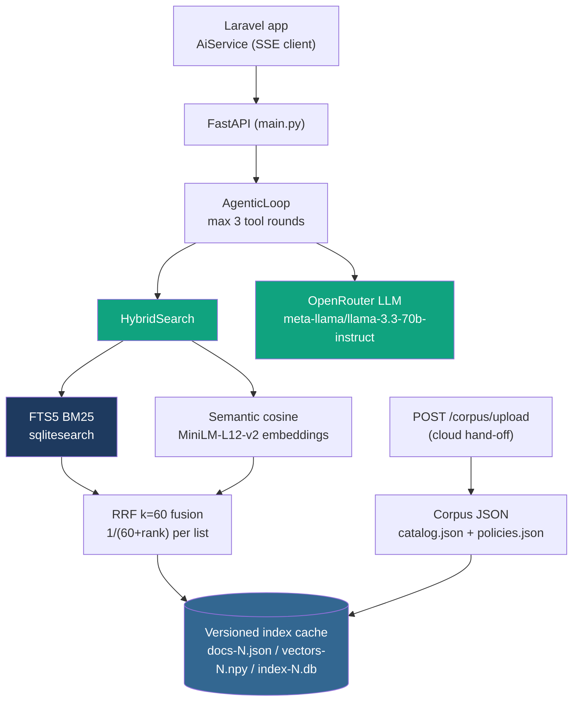

# CEIT AI Sidecar

<p align="center">
  
</p>

The hybrid search and RAG engine behind the [CEIT Library AI
assistant](https://github.com/PSergio984/CEIT-Library). A FastAPI
service that combines FTS5 BM25 keyword search with multilingual
semantic embeddings (`paraphrase-multilingual-MiniLM-L12-v2`), fused
with Reciprocal Rank Fusion (k=60) and post-retrieval metadata filters —
plus a bounded agentic search loop and streamed, citation-grounded chat
answers.

The Laravel app talks to it over HTTP with a shared `X-Sidecar-Token`;
the sidecar never touches the library database (files only).

## Problem

Keyword search alone misses paraphrase and Taglish questions; vector
search alone misses exact catalog codes (`CEIT-IT-23-01`). And a chat
assistant that answers from memory hallucinates. The sidecar exists to
make retrieval precise and answers grounded:

1. Hybrid retrieval: BM25 and semantic results fused by rank, so both
   exact and paraphrased queries work.
2. Filters: paper type, department, publication year range, author, and
   adviser — applied before fusion.
3. Agentic search: a bounded tool loop (max 3 searches) for multi-hop
   questions one-shot retrieval can't answer.
4. Grounded chat: answers cite numbered documents from the retrieved
   set, or refuse ("I don't have enough information") with zero LLM
   calls when retrieval finds nothing.
5. Freshness: atomic, versioned index rebuilds — readers never see a
   half-built index.

Target users: the CEIT-Library assistant itself (and any future client
that wants hybrid search over the library corpora).

## Quickstart

### Prerequisites

- Python 3.13
- [uv](https://docs.astral.sh/uv/)

### Local run

```bash
uv sync
cp .env.example .env   # fill SIDECAR_TOKEN (must match Laravel's SIDECAR_TOKEN)
uv run uvicorn app.main:app --port 8310
```

First run downloads the ~470 MB embedding model. The server binds
loopback only when run locally.

The corpus must exist at `CORPUS_PATH` (`catalog.json` + `policies.json`,
exported by the Laravel app's `ai:export-corpus`; default
`../ceit-library/storage/app/ai-corpus`). Build the index once:

```bash
curl -X POST -H "X-Sidecar-Token: $SIDECAR_TOKEN" http://127.0.0.1:8310/index/rebuild
```

### FastAPI Cloud deployment

The sidecar runs on [FastAPI Cloud](https://fastapi.cloud) via
`fastapi run` (requires the `fastapi[standard]` extra, which this repo
installs):

1. Deploy the repo; set env vars in the dashboard: `SIDECAR_TOKEN`,
   `LLM_API_KEY` (OpenRouter), `CORPUS_PATH=corpus`.
2. Corpus freshness is automatic: the Laravel `ai:push-corpus` command
   (scheduled hourly) uploads the export to `POST /corpus/upload`, which
   writes the files under `CORPUS_PATH` and rebuilds atomically.
3. Point the Laravel app at `SIDECAR_URL=https://<your-sidecar>.fastapi.app`.

## Endpoints

All endpoints require `X-Sidecar-Token`; requests without it get `401`.

| Method | Path             | Description                                   |
|--------|------------------|-----------------------------------------------|
| GET    | `/health`        | Index coverage + staleness (`documents == embedded`) |
| POST   | `/search`        | Hybrid RRF search with optional filters       |
| POST   | `/chat/stream`   | SSE-streamed RAG answer over search results   |
| POST   | `/index/rebuild` | Synchronous full rebuild (atomic swap, no downtime) |
| POST   | `/corpus/upload` | Replace `catalog.json`/`policies.json` in `CORPUS_PATH` and rebuild (multipart: `catalog`, `policies`, at least one; fail-closed on invalid JSON) |
| GET    | `/metrics`       | Minimal hand-rolled counters (Prometheus in Phase 14) |

`POST /chat/stream` request:
`{"query": "...", "mode": "citations"|"question"|"rag", "corpus"?: "catalog"|"policy", "top_k"?: 5}`.
Response is `text/event-stream`: `data: {"c": "<delta>"}` chunk lines,
terminated by `data: [DONE]`; provider failures surface as an
`event: error` line before `[DONE]`.

The LLM provider is OpenRouter via the openai SDK
(`LLM_BASE_URL`/`LLM_API_KEY`/`LLM_MODEL`, default
`meta-llama/llama-3.3-70b-instruct`).

## Testing

```bash
uv run pytest            # 78 tests: ranking, filters, API, agentic loop, ingest
uv run ruff check .      # lint gate
uv run ruff format --check .
```

Tests use a deterministic hash-based embedder and injected fake LLM
clients — no model download, no provider calls. A live smoke test
(`test_chat_stream_live.py`) is gated behind `SIDECAR_LIVE_CHAT_TEST=1`
and never runs in CI.

CI (GitHub Actions) runs lint, tests, an app-boot + auth smoke,
SonarCloud, and a secrets scan on every push.

## Evaluation

Golden-set retrieval evaluation against
[`data/golden_dataset.json`](data/golden_dataset.json) — 35 cases
(catalog + policy, including negative "should return nothing" cases).
Current results (k=5):

- Precision@5: **0.60**
- Recall@5: **0.86**
- F1@5: **0.63**
- Top-1 rate: **83%**
- Negative pass rate: **100%**

By category:

| Category | n | P@5 | Top-1 |
|----------|---|-----|-------|
| taglish (Taglish queries) | 6 | 0.80 | 0.50 |
| paraphrase | 14 | 0.70 | 1.00 |
| people (paper by author/adviser) | 4 | 0.50 | 1.00 |
| catalog_code (exact CEIT codes) | 2 | 0.30 | 0.50 |
| exact_title | 4 | 0.20 | 0.75 |

Run it yourself:

```bash
uv run python -m app.eval            # human-readable report
uv run python -m app.eval --json     # machine-readable report
uv run python -m app.eval --corpus policy
```

LLM-as-judge answer scoring is planned for Phase 13 of the roadmap.

## Architecture



### Search pipeline

1. **Keyword**: SQLite FTS5 via `sqlitesearch` — BM25 ranks over the
   full corpus (no candidate pooling).
2. **Semantic**: whole-document embeddings, normalized, cosine via
   matmul. No TF-IDF anywhere; no chunking.
3. **Filters**: paper type, department, publication year, year range,
   author, adviser — applied to the merged candidate set **before**
   fusion, so filtered-out documents never outrank relevant ones.
4. **Fusion**: RRF with k=60 (`1/(60 + rank)` per list).
5. **Code pin**: exact `CEIT-XX-NN[-N]` catalog codes pin the matching
   document to rank 1.

### Index lifecycle

Rebuilds are always full, from the exported JSON, into versioned
artifacts (`docs-N.json`, `vectors-N.npy`, `index-N.db`); `state.json`
is swapped last via `os.replace`, so readers never observe a half-built
index. Old versions are pruned (keep 2). Rebuilds serialize under a
global lock; the embedding model is a lazy thread-safe singleton.

### Agentic loop

`/chat/stream` runs a bounded function-calling loop (max 3 executed
searches, ADR 0014). The first LLM call carries a `search` tool; no tool
call in the response means direct answer (no search happened). Tool
arguments are validated against a closed pydantic schema
(`extra="forbid"` both levels) before execution; results merge into a
deduplicated, numbered citation set. SSE framing is additive:
`event: activity` → chunks → `event: citations` → `data: [DONE]`; empty
retrieval yields the canonical refusal with zero LLM calls.

## Monitoring

- `GET /health`: index coverage + staleness
  (`documents == embedded`, `source_generated_at`).
- `GET /metrics`: searches total, rebuilds total, average search
  latency, indexed documents.
- Prometheus/Grafana dashboards, rate limits, and cost guards are
  Phase 14 of the roadmap.

## Decisions and trade-offs

- **BM25 + semantic over vector-only**: catalog codes and exact titles
  are exact-match problems; paraphrase/Taglish need embeddings. RRF
  needs no score normalization across the two lists. Trade-off: two
  indexes to keep consistent — solved by the atomic versioned rebuild.
- **Whole-document embeddings over chunking**: simple, fast, and
  sufficient at corpus scale. Trade-off: prompts truncate documents at
  600 characters, losing detail on long papers — revisit point as the
  corpus grows.
- **sqlitesearch (FTS5) over an external engine**: zero-infra, file
  based, ships in-process. Trade-off: retrieval is full-corpus scan
  (no candidate pooling) — fine today, needs a bounded pool at scale.
- **Files-only contract over DB access**: the sidecar reads exported
  JSON (and accepts uploads) but never touches the Laravel database.
  Trade-off: corpus freshness depends on the export/push schedule.
- **OpenRouter over a direct provider**: one SDK, model swap via env.
  Trade-off: an API key to manage and rotate.
- **FastAPI Cloud over self-hosted**: managed HTTPS + autoscale for the
  token-gated endpoint. Trade-off: `CORPUS_PATH` must be fed via
  `POST /corpus/upload` (no shared disk with Laravel).

## Project structure

```text
app/
  main.py       # API: /search /chat/stream /index/rebuild /corpus/upload /health /metrics
  search.py     # HybridSearch: BM25 + semantic + RRF k=60, filters, code pin
  ingest.py     # corpus validation (fail-closed) + embeddings
  rebuild.py    # atomic versioned rebuild, global lock, test embedder hook
  rag.py        # RAG prompts, SSE chunk framing, citation keys
  agent.py      # AgenticLoop: bounded tool loop, closed arg schemas
  eval.py       # golden-set retrieval evaluation
  config.py     # pydantic-settings (env / .env)
  health.py     # /health assembly
data/
  golden_dataset.json   # 35 evaluation cases
tests/
  test_api.py           # endpoint behavior + auth
  test_rrf.py           # RRF fusion math
  test_filters.py       # filter-before-fusion semantics
  test_agentic_loop.py  # tool loop with fake clients
  test_chat_stream.py   # SSE framing
  test_chat_stream_live.py  # env-gated live smoke
  conftest.py           # deterministic embedder + temp corpora
```

## Dataset

The corpus is two JSON files exported from the Laravel database by
`ai:export-corpus`:

- `catalog.json` — academic papers (title, authors, advisers, dean,
  department, year, paper type, catalog code).
- `policies.json` — the library rulebook (headers + regulations).

The ingest step validates the envelope (`schema_version: 1`, required
fields, unique ids, parseable `generated_at`) and fails closed on any
violation — never a silent partial index. Exports contain author names
and are never committed to git.

## Limitations

- Prompt context per document is capped at 600 characters.
- No rate limits or cost guards on the LLM path (Phase 14).
- No chunking; long documents lose detail in the final prompt.
- Golden set is 35 cases — metrics improve as Phase 13 grows it.
- Single-instance, in-process state; no horizontal scaling.
- Provider failures surface as a user-safe error event, not a retry.
